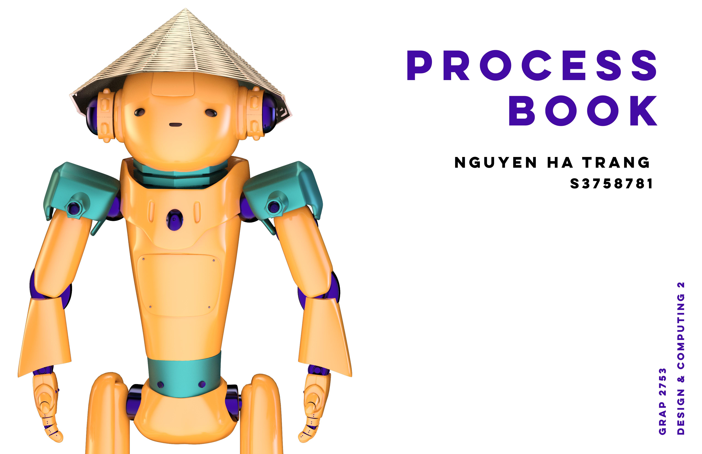
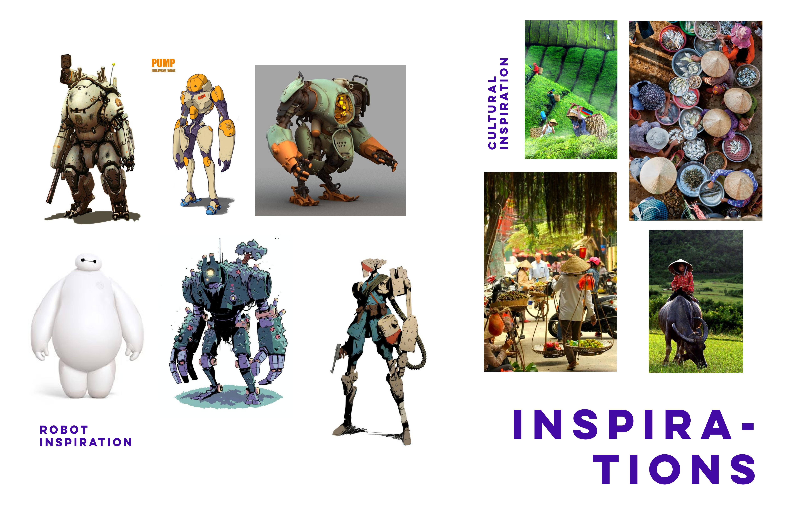
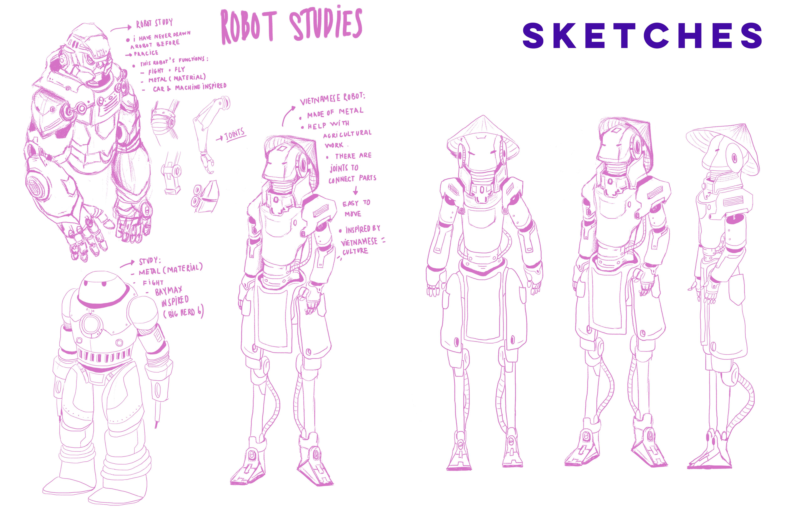
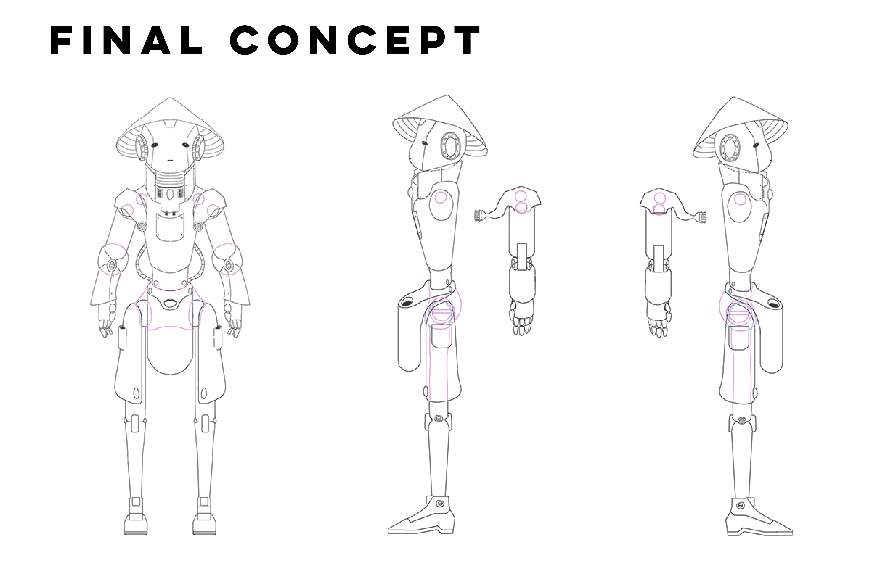
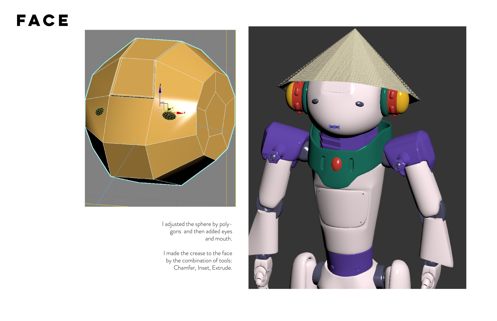
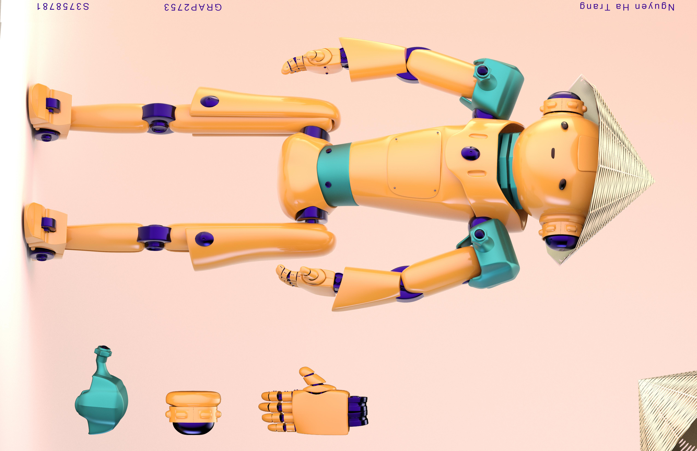

<!--StartFragment-->

hi xin chào !\
cuối cùng tớ cũng được thử sức với 3D, cái mà tớ khá là muốn được thử\
mà thử xong thì thấy hay ơi là hay mặc dù là khó lắm. cũng chính nó làm tớ thức đêm và stressed và đủ thứ trên đời\
nhưng dù sao thì cũng là 1 thứ hay ho đáng để thử và tớ vẫn muốn được thử tiếp ế hê\
Chú robot này được làm ra với mục đích giúp người dân trông lúa bởi vì tớ thích việt nam, hế hê\
\
tớ có để ở trên là cả những bức sketches từ đầu tớ vẽ rồi sau hoàn thiện hê\
trong quá trình làm thì tớ nghĩ tớ cũng thay đổi nhiều thứ nên lúc đầu nhìn nó cũng chiến binh mà sau nó nhìn đần đần kute\
tớ nghĩ tớ sẽ up album đầy đủ cả process của tớ khi làm chú robot riceminator (là tên Châu nghĩ hộ) này và chia sẻ với mọi người sau chứ giờ chú robot phải đi trồng lúa đã !

<!--EndFragment-->
